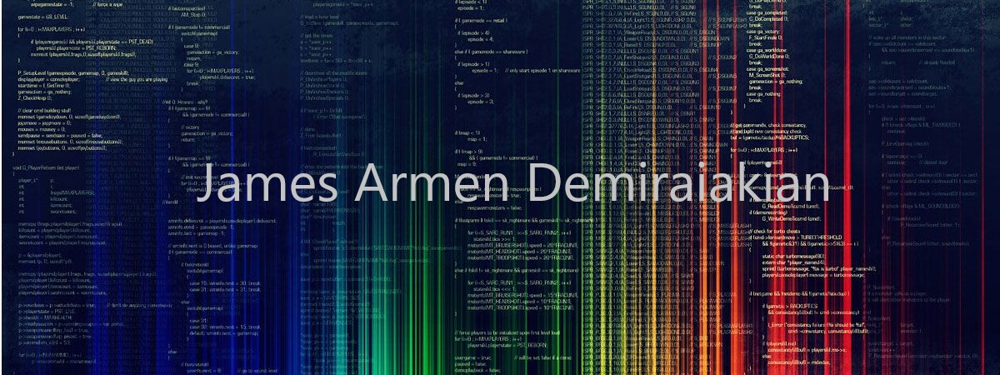

<!--Badges - each a link to a social -->
------
[]

<!-- Fancy looking link to portfolio site (MAKE PORTFOLIO SITE) -->

Hello!
I am a full stack Software Developer who is skilled in JavaScript based libraries and frameworks. I approach every task with a very strategic mindset, yet remain very adaptable to every change in my workplace and job requirements.

 

Skills
------

| Languages  | Libraries & Frameworks | Testing               | Dev Tools |
| :--------: | :--------------------: | :-------------------: | --------- |
| JavaScript | React                  | React Testing Library | VS Code   |
| HTML       | React Router           | MSW                   | GitHub    |
| CSS        | Node.js                | Jest                  | Git       |
| SQL        | Redux                  | QUnit                 | Netlify   |
|            | Supabase               | Supertest             | Postman   |
|            | Rest API               |                       | Miro      |
|            | Express                |                       | Heroku    |
|            | Material-UI            |                       |           |
|            | Tailwind               |                       |           |

<!--
**james-demiraiakian/james-demiraiakian** is a ✨ _special_ ✨ repository because its `README.md` (this file) appears on your GitHub profile.

Here are some ideas to get you started:

- 🔭 I’m currently working on ...
- 🌱 I’m currently learning ...
- 👯 I’m looking to collaborate on ...
- 🤔 I’m looking for help with ...
- 💬 Ask me about ...
- 📫 How to reach me: ...
- 😄 Pronouns: ...
- ⚡ Fun fact: ...
-->
